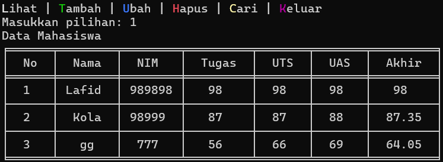

# Program Data Nilai Mahasiswa


# Cara Kerja Program Ini
1. Menampilkan menu kepada pengguna.
2. Meminta pengguna untuk memilih salah satu opsi.
3. Memanggil fungsi yang sesuai dengan pilihan pengguna.
4. Mengulang langkah 2 sampai pengguna memilih opsi keluar.

# Gambaran Flowchart


# Struktur Kode

### Modul


Program ini menggunakan modul Tabulate untuk menampilkan tabel data kepada pengguna.

### Dictionary


sebagai tempat untuk menyimpan setiap data yang diinputkan.

### Fungsi-Fungsi
```ruby
# fungsi ini menggunakan modul tabulate untuk mencetak table data
def tabel(data, headers=None, title=""):
    if not data: 
        table = [["Tidak ada data"]]
        print(tabulate(
            table, 
            headers =["Tidak ada data"], 
            tablefmt="fancy_grid", 
            colalign=("center",)
            ))
        return
    if headers is None:
        headers = ["No", "Nama", "NIM", "Tugas", "UTS", "UAS", "Akhir"]
    table = []
    for i, nama in enumerate(data, start=1):
        row = [
            i, 
            nama, 
            data[nama]["NIM"], 
            data[nama]["Nilai Tugas"], 
            data[nama]["Nilai UTS"], 
            data[nama]["Nilai UAS"], 
            data[nama]["Nilai Akhir"]
            ]
        table.append(row)
    print(f"{title}")
    print(tabulate(
        table, 
        headers, 
        tablefmt="fancy_grid", 
        colalign=("center",)*7
        ))
```
```ruby
# fungsi untuk memastikan input adalah angka
# dan mengulangi permintaan jika input bukan angka
# juga membatasi nilai input yang diinputkan.
def nilai(str):
    while True:
        try:
            poin = float(input(str))
            if poin < 0 or poin > 100:
                print(f"Nilai harus berkisar dari 0 hingga 100.")
            else:
                return poin
        except ValueError:
            print("Input harus berupa angka!!")    
```
```ruby               
# fungsi ini akan meminta input nama dari user
# melihat apakah nama tersebut ada di database atau tidak
def namamu(str, harus_ada=True):
    while True:
        nama = input(str)
        if harus_ada and nama not in mahadata:
            print("nama tidak ditemukan!")
        elif not harus_ada and nama in mahadata:
            print("nama sudah ada di database. Masukkan nama lain!")
        else:
            return nama  
```
```ruby         
# fungsi minta input data``
# sekaligus melihat apakah data dengan nama yang sama ada di dictionary   
def minta(nama):
    tugas, uts, uas = map(nilai, [
            "Masukkan Nilai Tugas: ", 
            "Masukkan Nilai UTS: ", 
            "Masukkan Nilai UAS: "
            ])
    akhir = (tugas*0.3) + (uts*0.35) + (uas*0.35)
    if nama not in mahadata:
        NIM = input("Masukkan NIM (e.g. 123456789): ")
        return {
            "Nama": nama,
            "NIM": NIM,
            "Nilai Tugas": tugas,
            "Nilai UTS": uts,
            "Nilai UAS": uas,
            "Nilai Akhir": akhir
        }
    elif nama in mahadata:
        return {
            "Nama": nama,
            "NIM": mahadata[nama]["NIM"], # NIM dari data lama
            "Nilai Tugas": tugas,
            "Nilai UTS": uts,
            "Nilai UAS": uas,
            "Nilai Akhir": akhir
        }
```
```ruby  
# fungsi yang akan menambahkan data yang sudah diterima fungsi minta
# ke dalam dictionary
def tambah():
    nama = namamu("Masukkan Nama: ",harus_ada=False)
    mahadata[nama] = minta(nama)
    print("Data berhasil ditambahkan.")
```  
```ruby
# fungsi akan mencari data dengan nama yang sesuai
# kemudian meminta input data baru
# input tersebut akan menggantikan data yang sudah ada
def ubah():
    nama = namamu("Masukkan Nama: ")
    mahadata[nama] = minta(nama)
    print("Data berhasil diubah.")
```
```ruby    
# fungsi ini gunanya untuk hapus data dari dictionary
def hapus():
    nama = namamu("Masukkan Nama: ")
    del mahadata[nama]
    print("Data berhasil dihapus.")
```
```ruby  
# fungsi untuk menampilkan data yang ada di dictionary
def lihat():
    tb.tabel(mahadata, title="Data Mahasiswa") 
```
```ruby
# akan mencari dengan nama
# data dengan nama tersebut akan ditamplikan kepada user
def cari():
    nama = namamu("Masukkan Nama: ")
    tb.tabel({nama: mahadata[nama]}, title=f"Data Mahasiswa dengan Nama {nama}")
```


### Menu

Program akan terus menampilkan menu kepada pengguna sampai opsi keluar di pilih. Setiap opsi akan memanggil fungsi yang sesuai.


# Output Dari Program Ini
```Menambahkan Data```


```Menampilkan tabel data```



```Mengubah data```


```Mencari```

 

```Menghapus data```


```Keluar```

